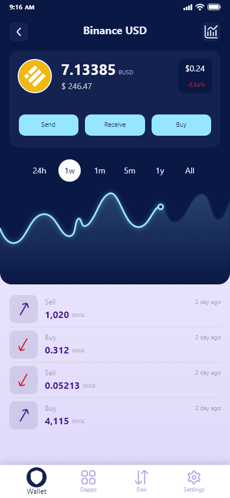

# Arab Gate

## All in One Gate

Arab Gate is a non-custodial wallet that will connect billions of users around the world safely. Arab Wallet offers multi-chain (NFT & cryptocurrency), DEX, Cross-chain Bridge & DApp Browser, and others.

Arab Gate is a key component of future multichain protocols/applications, acting as a single point of access to various DeFi services across multiple blockchains. By having variations on the wallet, we have established a solid platform for expanding our product suite.

We believe that cross-chain and multi-chain architectures are the future of blockchain. Therefore, Arab Gate App is the first product we've decided to develop as a non-custodial wallet powered by a cutting-edge multi-chain wallet engine. As the core of our suite of products, Arab Gate App enables our users to engage with protocols on several blockchains in the most simple manner possible.

## FEATURES

**What makes Arab Gate stand out?**

#### Low fees, high speeds

###

**Hight security**

Your private keys can't leave your device. Using strong wallet encryption and cryptography, you can rest assured that your assets are safe and secure.

**Anonymity/privacy**

There is no KYC bureaucracy to gain access to your assets, no IP, and transaction tracking.

**Buy assets with your card**

Purchase Assets directly from Arab Gate.

**DApp Browser & Web3 support**

Access your favorite DApps with Arab Gate’s integrated DApp Market and Web3 without compromising security.

**Full asset support**

Full support for Bitcoin and every ERC20, BEP2, BEP20, TRC10 tokens. Assets from more protocols.

#### Multi-chain

Bitcoin and other major altcoins and tokens are supported. Coin selection and addition is done with the utmost care.

**NFT**

Full support for ERC721, ERC1155, SLP tokens, store, access, and manage your collectibles with peace of mind and security using Arab Gate’s innovative interface.
